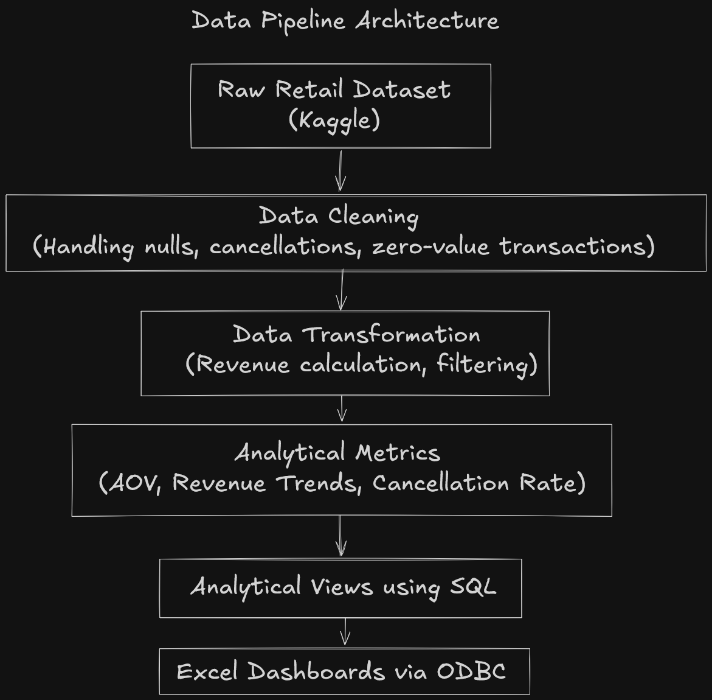
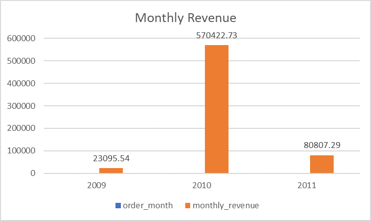
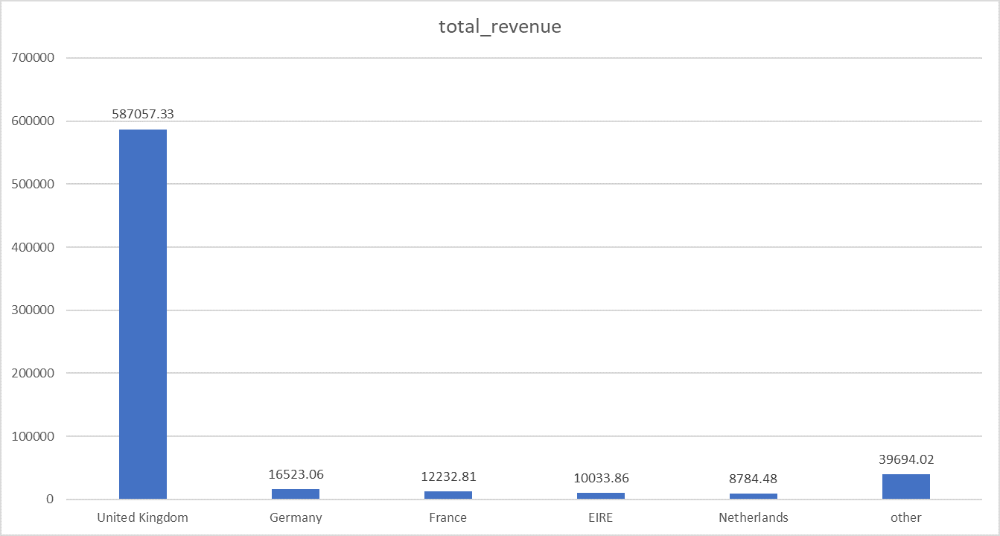
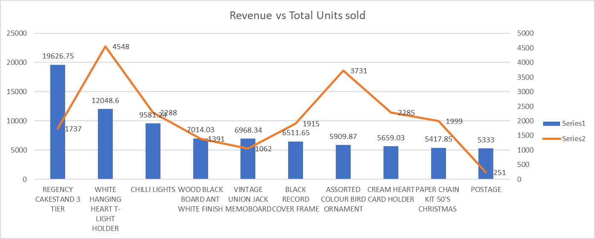

# Retail Sales ETL Pipeline using MySQL & Excel 

## Project Overview 

This project focuses on analyzing retail transaction data to identify revenue trends, product performance, customer purchasing behavior, and order cancellation patterns. The objective is to transform raw transactional data into meaningful business insights using SQL-based analytical techniques and present key performance indicators through interactive dashboards. 

## Tech Stack 

- MySQL – Data Cleaning & Transformation & Analytical Queries
- Excel – Dashboard Visualization
- ODBC Connector – Database Connectivity

## Dataset Description

The dataset contains transactional data for a UK-based online retail store selling giftware products between 2009 and 2011. 
It includes details of customer purchases such as invoice numbers, product descriptions, quantities, invoice dates, unit prices, customer IDs, and country of origin. 

## Dataset Features

- InvoiceNo – Unique invoice number for each transaction
- StockCode – Unique product/item code
- Description – Product name
- Quantity – Number of items purchased
- InvoiceDate – Date and time of purchase
- UnitPrice – Price per unit of product
- CustomerID – Unique identifier for each customer
- Country – Country of the customer

## Data Challenges
- Missing Customer IDs
- Cancelled invoices
- Zero-value transactions
- Duplicate entries
- Negative quantities (product returns)

## Pipeline Architecture 

 

## Steps Followed 

## 1. Data Acquisition

The Online Retail II dataset was downloaded from Kaggle in Excel (.xlsx) format.
The dataset contains raw transactional records including product purchases, invoice details, customer IDs, and country information from an online retail store.

## 2. Data Import into MySQL

The downloaded dataset was imported into a MySQL database to enable structured querying and transformation using SQL.
The Excel file was first converted into CSV format and then imported into MySQL using the Table Data Import Wizard. 

## Purpose of Importing into MySQL

Importing the dataset into MySQL allows:

- Structured data storage
- Efficient data cleaning
- SQL-based transformations
- Creation of analytical views
- Implementation of aggregation and window functions

## 3. Table Creation Workflow

To ensure data integrity during the cleaning process, multiple table layers were created:

- retail_raw: Contains original imported dataset
- retail_staging: Used for intermediate cleaning steps
- retail_staging2: Handles duplicate removal and filtering
- retail_sales_cleaned: Final cleaned dataset for analysis

## 4. Data Cleaning

- Handled duplicate records
- Filtered cancelled invoices 
- Removed records with missing Customer IDs
- Eliminated zero-value transactions
- Created calculated revenue column 

## Purpose of Staging Tables

Duplicate tables were created to:

- Preserve the original raw dataset
- Apply cleaning operations incrementally
- Avoid irreversible data loss during transformation
- Enable rollback in case of cleaning errors

## Data Cleaning & Layer Summary 

| Table Name             | No. of Rows | Notes / Cleaning Applied                                          |
| ---------------------- | ----------- | ----------------------------------------------------------------- |
| `retail_2009`          | 1,049       | Only 2009 data                                                    |
| `retail_2010`          | 29,358      | Only 2010 data                                                    |
| `retail_combined`      | 30,407      | Combined 2009 & 2010 datasets                                     |
| `retail_staging`       | 30,407      | Initial staging table                                             |
| `retail_staging2`      | 29,878      | Removed duplicate records                                         |
| `retail_sales_cleaned` | 29,825      | Removed negative quantities, cancelled orders, empty Customer IDs |

Each layer progressively removes unwanted or duplicate records to prepare the dataset for analysis. 

## 5. Business Questions Addressed

- Which countries generate the highest revenue?
- What are the monthly revenue trends?
- Which products contribute most to total revenue?
- What is the Average Order Value (AOV) per customer?
- What percentage of orders are cancelled?
- How can customers be segmented based on purchasing behavior?

## 6. Key Metrics Computed

- Monthly Revenue
- Revenue Growth
- Product Revenue Contribution (%)
- Average Order Value (AOV)
- Country-wise Revenue
- Cancellation Rate
- RFM-based Customer Segmentation

## 7. Dashboards

The following dashboards were created to visualize decision-critical KPIs:

- Monthly Revenue Trends
   
- Country-wise Revenue Performance
   
- Product Revenue Contribution
   

## Analytical Techniques

- Common Table Expressions (CTEs)
- Window Functions (LAG, NTILE)
- Aggregate Functions (SUM, COUNT)
- RFM Segmentation
- Revenue Contribution Analysis

## Business Metrics Calculation 

### 1. Monthly Revenue 
Monthly Revenue was calculated by aggregating total revenue generated per month.

Revenue = Quantity × UnitPrice

Monthly Revenue = SUM(Revenue) grouped by Order_Year and Order_Month 

To identify revenue trends over time and understand seasonal sales performance.

### 2. Product Revenue Contribution (%)

Product Contribution (%) = (Product Revenue / Total Revenue) × 100 

To identify high-performing products contributing significantly to total revenue and support inventory and marketing decisions. 

### 3. Average Order Value (AOV)

AOV = Total Revenue per Customer / Number of Unique Invoices 

Invoices were used to determine the number of orders placed by a customer. 

To understand customer spending behavior and identify high-value customers. 

### 4. Country-wise Revenue

Country Revenue = SUM(Revenue) grouped by Country 

To identify geographical regions contributing the most to total revenue and detect potential target markets. 

### 5. Cancellation Rate

Cancelled Orders = COUNT(DISTINCT InvoiceNo WHERE InvoiceNo LIKE 'C%')

Total Orders = COUNT(DISTINCT InvoiceNo)

Cancellation Rate (%) = (Cancelled Orders / Total Orders) × 100 

Cancelled invoices are marked with 'C' in the InvoiceNo field. 

To measure order return or cancellation frequency across different regions. 

### 6. RFM Metrics

Recency = Days since last purchase
Frequency = Number of unique invoices per customer
Monetary = Total revenue generated by customer

Customers were segmented into groups using quartiles based on:
 - Recency
 - Frequency
 - Monetary Value

To classify customers based on purchasing behavior for targeted engagement strategies. 

### 7. Revenue Quartile Segmentation

Products were divided into 4 groups using NTILE(4)
based on total revenue generated. 

To categorize products into performance tiers for prioritization. 

## Key Insights Dervied 

### 1. Revenue Trend Analysis 

1. Total Revenue : 674325.56
2. Yearly Revenue : 2009 - 23095.54, 2010 - 570422.73, 2011 - 80807.29
3. AOV Per Year : 2009 - 23.736423, 2010 - 22.221376, 2011 - 25.395126
4. Cumulative Revenue Per Year :
   |     Year     | Monthly revenue | Yearly revenue3 |
   |--------------|-----------------|-----------------|
   |     2009     |     23095.54    |     23095.54    |
   |     2010     |     570422.7    |    593518.27    |
   |     2011     |     80807.29    |    674325.56    | 

### 2. Product Performance Analysis 

1. Top 10 products by revenue
2. Top 10 products from units sold
3. Revenue contribution per product
4. Revenue Quartiles per product
5. Top 10 products by quantity - units sold

### 3. Customer behaviour analysis 

1. Most frequent customers by invoice id
2. Average Order Value (AOV) per customer
3. Top customers by revenue
4. Repeat Purchase Patterns
5. Average time between orders
6. Country wise customer revenue

### 4. Country/Region sales analysis 

1. Revenue by country
2. Average revenue per customer by country/region
3. Average Order Value per country
4. Country Revenue Quartiles

### 5. Cancelled Orders analysis 

The retail_staging2 table is used because it consists of the cancelled orders 

1. Find the total count of cancelled orders
2. Product-level cancellation rate
3. Find the total count of cancelled orders by product
4. Revenue Lost due to returns
5. Products with highest returns
6. Order-level cancellation rate

### 6. Customer Segmentation 

1. Find recency
2. Find frequency
3. Find Monetary
4. Using CTE's RFM segments are found

| Receny_quartile | Frequency_quartile | Monetary_quartile | Quartile |
| --------------- | ------------------ | ----------------- | -------- |
| 1               | 4                  | 4                 | VIP      |
| (1, 2)          | >= 3               | >= 3              | Loyal    |
| 4               | <=2                | <= 2              | At risk  |
| 4               | 1                  | 1                 | Lost     | 

## Conclusion

This project demonstrates how messy data is cleaned and transformed to extract actionable insights from raw transactional datasets.

Through SQL-based cleaning, metric computation, and segmentation techniques such as RFM analysis, the dataset was converted into analytical views that support business decision-making.

The dashboards serve as the presentation layer, while the SQL transformations form the analytical backbone of the pipeline. 

